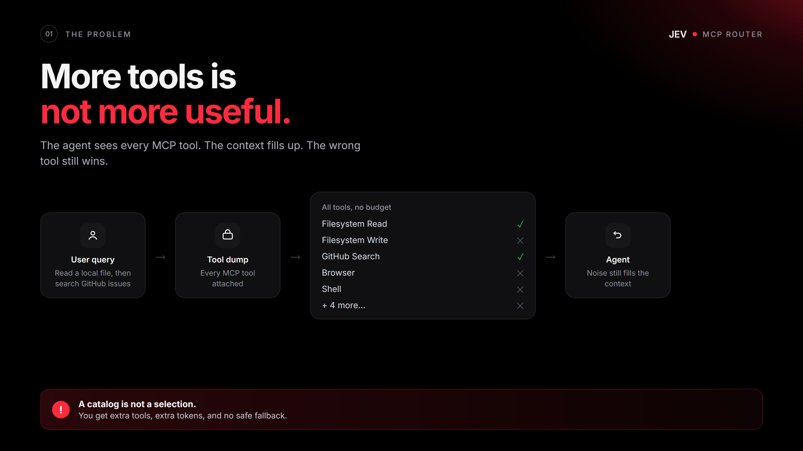
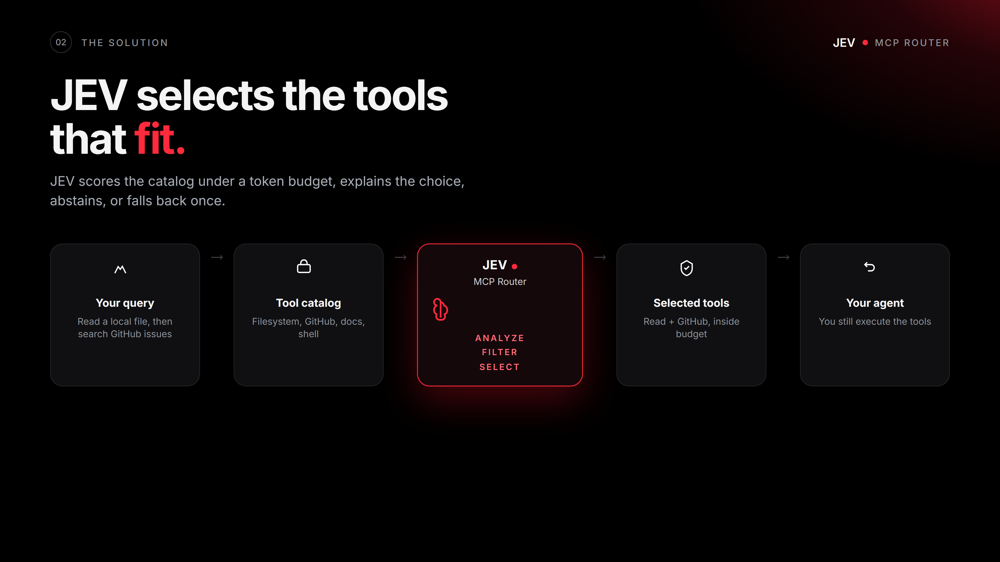
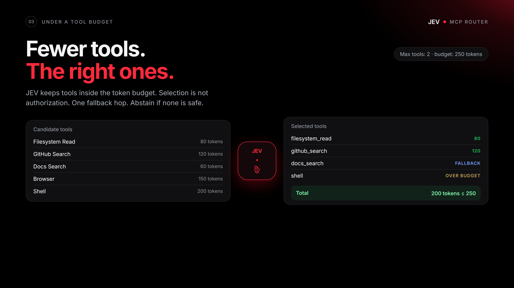
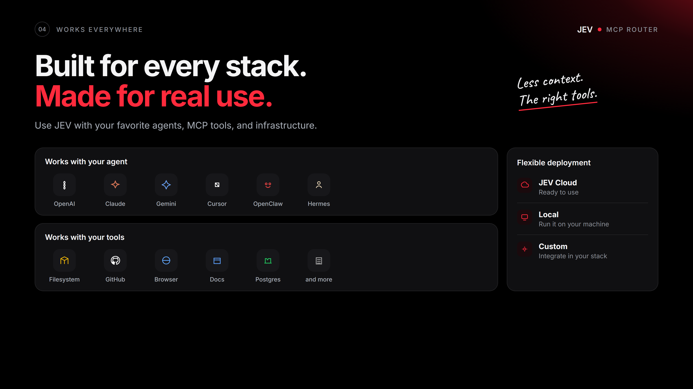

# jev-mcp-router

Selects the MCP tools that fit the query, inside a context budget.

Author: [Pinuts](https://github.com/Pinutss). MIT license.

Part of [JEV Labs](https://github.com/Pinutss/jev-labs).

Stack: Python 3.10+, HTTP, MCP stdio, Docker, HTML demo.

After `jev-mcp serve`: [demo](http://127.0.0.1:8080/)

<p>
  
  
</p>
<p>
  
  
</p>

## Local, no keys

```bash
git clone https://github.com/Pinutss/jev-mcp-router
cd jev-mcp-router
uv sync
uv run jev-mcp demo
uv run jev-mcp serve
```

No agent and no LLM are required. `JEV_PROVIDER=auto` (the default) stays on the local heuristic. If JEV and a gateway are configured, they are used as the judge. Docker:

```bash
docker compose up
```

## What the prototype does

The selector chooses tools from a catalog, under a token budget. It explains the choice, abstains if no candidate is safe, and allows only one fallback hop.

It does not run tools and does not ship them.

Selection is not authorization. Permissions come only from the catalog and the caller constraints. The task, a tool, or a model cannot add them.

## Hermes and OpenClaw

Yes, locally. The MCP process does not need JEV or a gateway:

```bash
uv run jev-mcp mcp
```

One tool: `mcp_select`. Pass `query` + `tools`. Keys stay in the process environment, not in the call.

**Hermes** (`~/.hermes/config.yaml`):

```yaml
mcp_servers:
  jev-mcp:
    command: uv
    args: ["run", "--directory", "/path/to/jev-mcp-router", "jev-mcp", "mcp"]
    env:
      JEV_PROVIDER: local
```

**OpenClaw** (`~/.openclaw/openclaw.json`, or Settings > MCP > Stdio):

```json
{
  "mcp": {
    "servers": {
      "jev-mcp": {
        "command": "uv",
        "args": ["run", "--directory", "/path/to/jev-mcp-router", "jev-mcp", "mcp"],
        "env": { "JEV_PROVIDER": "local" }
      }
    }
  }
}
```

## Python

```python
from jev_mcp_router import McpSelector, DEFAULT_TOOLS

result = McpSelector(provider="local").select(
    query="Read a local file, then search GitHub issues",
    tools=DEFAULT_TOOLS,
    max_tools=2,
    budget_tokens=250,
    scope="demo",
)
print(result.decision, [item.id for item in result.selected])
```

## JEV + gateway (optional)

If you wire the cloud later, two keys are enough: `JEV_API_KEY` / `JEV_BASE_URL`, and your gateway. If `GATEWAY_*` is incomplete, the multi-LLM catalog resolves the judge (`OPENROUTER_API_KEY`, `OPENAI_API_KEY`, and similar).

No key in the HTTP or MCP body.

```bash
cp .env.example .env
```

`JEV_PROVIDER=jev` will not start if JEV or the resolved gateway is missing. With `auto`, missing keys just keep the local heuristic.

Public catalog: `GET /v1/llms`. You can also point `JEV_MODELS_FILE` at a JSON catalog.

## HTTP

```bash
uv run jev-mcp serve
```

`GET /`, `/demo`, `/healthz`, `/v1/llms`. `POST /v1/select`. Binds `127.0.0.1`. The body must not contain keys. It may contain `gateway_provider`, `gateway_model`, `llm_prefer`.

## Local validation

```bash
uv run jev-mcp benchmark
```

Annotated set in `benchmarks/annotated_tasks.json`. This is a local baseline, not a live JEV trial.

## Limits

Local ranking is lexical and deterministic. Scope isolates lists, it is not auth. One fallback hop. No tool execution. No store, no PyPI yet.

`docs/vision.md` is a long-term target, not the current contract.
